# 原始请求

请求类是一个抽象的通用类，但不同请求的结构数据不同，无法优雅的集成，所以DCE定义了原始请求类`\dce\project\request\RawRequest`，用来存储原始请求数据，并抽象出同类接口方法。


## \dce\project\request\RawRequest;

原始请求类，抽象类（凡是后面带分号的，都表示抽象类或方法）


### `->method`
`string` 请求类型（在实现类中填充）


### `->path`
`string` 请求路径（在实现类中填充）


### `->remainingPaths`
`array = []` 惰性路由匹配时剩余未被匹配的路径组件集（在实现类中填充）


### `->getRaw();`
取原始请求信息（抽象方法，在子类实现）


### `->init();`
初始化，填充类的必填属性（抽象方法，在子类实现）


### `->routeGetNode();`
路由并取节点（抽象方法，在子类实现）


### `->supplementRequest();`
完善`请求对象`属性（抽象方法，在子类实现）

- 参数
  - `\dce\project\request\Request $request` 请求对象


### `->getClientInfo();`
取客户端信息（抽象方法，在子类实现）


### `->getRawData()`
取原始请求提交的数据

- 返回`mixed`


## \dce\project\request\RawRequestCli

命令行类原始请求类


### `->getRaw()`
取`$argv`

- 返回`array`


### `init()`
标记`->method`为'cli'，解析命令行参数

- 返回`void`

#### 参数提取逻辑



### `routeGetNode()`
根据命令行参数路由并返回找到的节点

- 返回`\dce\project\node\Node`


### `supplementRequest()`
完善`请求对象`属性（rawData,request,cli,pureCli）


## \dce\project\request\RawRequestHttp;

Http版原始请求抽象类


### `->isHttps`
`bool` 是否Https请求

### `->host`
`string` 请求主机

### `->queryString`
`string` Url查询字符串

### `->requestUri`
`string` 请求URI

### `->httpOrigin`
`string` 发起Http请求的主机

### `->userAgent`
`string` 用户代理标识

### `->remoteAddr`
`string` 客户端IP

### `->serverPort`
`int` 服务端口


### `->header();`
设置响应头

- 参数
  - `string $key` 响应信息键
  - `string $value` 响应信息值

- 返回`void`

- 示例
```php
$rawRequest->header('Location', 'https://drunkce.com');
```


### `->response();`
响应Http请求

- 参数
  - `string $content` 响应内容

- 返回`void`


### `->export();`
导出文件

- 参数
  - `string $filepath` 待导文件路径
  - `int $offset = 0` 起始导出偏移
  - `int $length = 0` 导出长度

- 返回`void`


### `->initProperties();`
完善属性


### `->supplementHttpRequest();`
补充`请求`对象


### `->status();`
状态码响应

- 参数
  - `int $statusCode` 状态码
  - `string $reason` 说明

- 返回`void`

- 示例
```php
$rawRequest->status(404, 'Not Found');
```


### `->redirect();`
重定向

- 参数
  - `string $jumpUrl`
  - `int $jumpCode = 302`

- 返回`void`

- 示例
```php
$rawRequest->redirect('https://drunkce.com', 301);
```


### `init()`
初始化完善Http请求头信息的类属性填充


### `routeGetNode()`
根据请求地址路由匹配节点


### `supplementRequest()`
完善`请求对象`属性（rawData,request,get,post,...）


## \dce\project\request\RawRequestHttpCgi

Cgi版`\dce\project\request\RawRequestHttp`抽象类的实现类，实现了全部抽象方法
