# 视图

DCE的视图不只是传统意义上的HTTP响应数据渲染器，而是对所有的输出的抽象，如命令行的输出、长连接的消息推送等。


## \dce\project\view\View;

视图基类，主要定义了一些数据缓存器方法


### `->request`
`\dce\project\request\Request` 请求对象


### `__construct()`
构造函数，做了些如请求对象属性赋值的初始化工作，控制器类若需要定义构造函数，请务必在内部先调用父类构造方法。

- 参数
  - `\dce\project\request\Request $request`

- 示例
```php
class UserCenterController extends ViewHttpJson {
    public function __construct(Request $request) {
        parent::__construct($request);
        $instance->validRole();
    }
}
```


### `->assign()`
暴露指派模板变量

- 参数
  - `string $key`
  - `mixed $value`

- 返回`$this`

- 示例
```php
class HelloController extends ViewHttpHtml {
    public function index() {
        $this->assign('hello', 'Hello World !');
    }
}
```


### `->assignMapping()`
批量暴露指派模板变量

- 参数
  - `array $mapping` 待指派的变量键值对

- 返回`$this`


### `->getAssigned()`
取指派的变量

- 参数
  - `string $key`

- 返回`mixed`


### `->getAllAssigned()`
取指派的变量集

- 返回`array`


### `->clearAssigned()`
清除所有指派的值

- 返回`void`


### `->assignStatus()`
设置外层状态数据

- 参数
  - `string $key` 状态属性名
  - `mixed $value` 状态值

- 返回`$this`

- 示例
```php
class ArticleController extends ViewHttpJson {
    public function save() {
        // 存库成功
        $this->assignStatus('status', true);
    }
}
```


### `->getAllAssignedStatus()`
取全部状态数据

- 返回`array`


### `->call()`
调用控制器方法（Dce自动调用）

- 参数
  - `string $method` 控制器方法名

- 返回`void`


## \dce\project\view\ViewCli;

命令行视图基类，封装了命令行的输入输出接口。


### `->input()`
打开命令行输入框并获取输入内容

- 参数
  - `string $label = ''` 输入框前置提示
  - `int $size = 1024` 获取输入长度

- 返回`string`


### `->print()`
命令行输出

- 参数
  - `string|int|Stringable $value` 待输出值
  - `string $suffix`

- 返回`void`


### `->printf()`
用`sprintf`格式化后输出到命令行

- 参数
  - `string $format` 格式化规则
  - `... $arguments` 待输出值，不限数（若非字符串，则会自动json编码）

- 返回`void`

- 示例
```php
// [PROJECT_NAME]/controller/ServerController.php

namespace [PROJECT_NAME]\controller;

use dce\project\view\ViewCli;

class ServerController extends ViewCli {
    public function hi() {
        $input = $this->input();
        $this->printf("您输入的是: %s", $input);
    }
}
```


## \dce\project\view\ViewHttp;

Http视图基类


### `->httpRequest`
`\dce\project\request\RawRequestHttp` Http原始请求类（为了方便取用，从Request类中取出来直接赋到了View类上）


### `->status()`
常用Http异常状态码

- 参数
  - `int $code` 响应状态码
  - `string $reason = ''` 状态原因

- 返回`void`


### `->render()`
渲染数据（Dce会自动调用，你可以在控制器中手动调用，手动调用后将不会被自动调用）

- 返回`void`


### `->response()`
响应Http请求（如果你需要自己处理响应，可以调用此方法，调用后`->render()`方法将不再被自动调用）

- 参数
  - `string $content` 响应内容

- 返回`void`


### `->setContentType();`
设置响应内容类型

- 返回`void`


### `->rendering();`
渲染页面数据

- 返回`string`


### 接口缓存
Http视图支持接口缓存，通过节点参数配置，[点击查看详情](/config/node.md#apicache)

#### 缓存逻辑
---



## \dce\project\view\ViewHttpHtml;

Http Html视图类


### 模板

DCE没有设计专门的模板语言/语法，而是直接使用的PHP脚本作为Html模板。因为PHP本省已是足够简洁的标记语言，且可以直接解析，无法转译，能提高程序性能，所以DCE决定直接用PHP作为模板。

PHP模板定义于`[PROJECT_NAME]/view/`目录下，文件路径定于节点配置的`phpTemplate`属性，完整路径为`"[PROJECT_NAME]/view/" . $node->phpTemplate`。

DCE模板也支持布局视图，布局文件路径定义于节点配置的`templateLayout`属性，你可以在布局文件中引入页面框架的固定组件（如页头页脚等），使用`<?php // layout_content ?>`表示要用渲染页面内容替换的区域。节点的布局文件属性会被子节点继承，如果某个子节点不需要布局，可以单独定义为空字符串覆盖父布局表示不使用布局，当然也可以定义为其他布局文件。

- 单模板示例

```php
// 节点配置
[
  'php_template' => 'gallery/index.php',
]
```

```php
<?php // 模板文件 [PROJECT_NAME]/view/gallery/index.php ?>
<!doctype html>
<html lang="zh">
<head>
    <meta charset="UTF-8">
    <title>Dce Websocket Sample</title>
</head>
<body>
    <?=$hello?>
</body>
</html>
```

- 模板布局示例

```php
// 节点配置
[
  'php_template' => 'gallery/index.php',
  'template_layout' => 'layout/default.php',
]
```

```php
<?php // 布局文件 [PROJECT_NAME]/view/layout/default.php?>
<?php require 'header.php';?>
<?php // layout_content ?>
</body>
</html>
```

```php
<?php // 头部文件 [PROJECT_NAME]/view/layout/header.php?>
<!doctype html>
<html lang="zh">
<head>
    <meta charset="UTF-8">
    <title>Dce Websocket Sample</title>
</head>
<body>
```

```php
<?php // 主体模板文件 [PROJECT_NAME]/view/gallery/index.php?>
<div>
    <?=$hello?>
</div>
```

### `->render()`
渲染PHP Html模板

- 返回`void`

- 示例
```php
// [PROJECT_NAME]/controller/gallery/GalleryController.php

namespace [PROJECT_NAME]\controller\gallery;

use dce\project\view\engine\ViewHttpHtml;

class GalleryController extends ViewHttpHtml {
    public function save() {
        $this->assign('hello', 'Hello World !');
    }
}
```


## \dce\project\view\ViewHttpApi;

Http接口型视图类


### `->success()`
渲染Api成功的结果

- 参数
  - `? string $message = null` 附加消息
  - `? int $code = null` 状态码

- 返回`void`


### `->fail()`
渲染Api失败的结果

- 参数
  - `? string $message = null` 失败消息
  - `? int $code = null` 失败状态码

- 返回`void`

- 示例
```php
// [PROJECT_NAME]/controller/gallery/GalleryController.php

namespace [PROJECT_NAME]\controller\gallery;

use dce\project\view\engine\ViewHttpJson;

class GalleryController extends ViewHttpJson {
    public function save() {
        $this->fail('保存失败', 40001);
    }
}
```


### `->exception()`
异常失败的结果（内部调用`->fail()`方法实现的）

- 参数
  - `\Throwable $throwable`

- 返回`void`


## \dce\project\view\ViewHttpJson;

Http Json响应渲染器


### `->render()`
渲染Json

- 返回`void`

- 示例
```php
// [PROJECT_NAME]/controller/gallery/GalleryController.php

namespace [PROJECT_NAME]\controller\gallery;

use dce\project\view\engine\ViewHttpJson;

class GalleryController extends ViewHttpJson {
    public function save() {
        $this->assign('photo_id', 1);
        $this->success('保存成功');
    }
}
```


## \dce\project\view\ViewHttpJsonp;

Http Jsonp渲染器


### `->render()`
渲染Jsonp

- 返回`void`

- 示例
```php
// [PROJECT_NAME]/controller/gallery/GalleryController.php

namespace [PROJECT_NAME]\controller\gallery;

use dce\project\view\engine\ViewHttpJsonp;

class GalleryController extends ViewHttpJsonp {
    public function save() {
        $this->assign('photo_id', 1);
        $this->success('保存成功');
    }
}
```


## \dce\project\view\ViewHttpXml;

Http Xml渲染器


### `->render()`
渲染Jsonp

- 返回`void`

- 示例
```php
// [PROJECT_NAME]/controller/gallery/GalleryController.php

namespace [PROJECT_NAME]\controller\gallery;

use dce\project\view\engine\ViewHttpXml;

class GalleryController extends ViewHttpXml {
    public function save() {
        $this->assign('photo_id', 1);
        $this->success('保存成功');
    }
}
```