# 分库中间件

当数据表中数据量到达一定量后读写性能会直线下降，这时需要拆分该表，将数据分储到各分表以提升性能。但拆分后读写数据需要向各分库发请求，需要按某规则路由请求，从各分库取到数据后需合并计算，相当繁琐。Dce分库中间件就这些问题出发，封装了一套标准分库查询组件，对分库查询自动路由并合并计算，让你无感地进行分库查询，专注业务的开发。


## 简介

提升数据库性能的方法有很多，有表优化、索引优化、主从复制库（读写分离、全主复制）、分库分表等。表与索引优化是比较基础的方法，很快会因为磁盘IO瓶颈而达到性能上限。这时你可以考虑主从复制库，通过复制库来分散承担原来单库承担的业务压力，能非常有效的提高业务响应能力。但它也有一些问题，数据同步的问题不必说，是同步组件或者微调业务能解决的问题，但当数据量大到一定级别，一个查询请求都无法及时响应时，再多的复制库也无法解决问题，这时你需要拆分数据，也就需要用到我们的分库中间件。当然，你不经过前面那些阶段，直接横向分库，使用分库中间件查询，也能提升业务性能。

Dce分库中间件根据ID分库，支持ID按模分库与ID区间分库，前面章节的[ID生成器](/sharding/id_generator.md)组件就是为分库中间件服务。对于插入记录，先通过ID生成器生成ID，将ID按模取余数、或定位ID所在区间锁定目标库，然后向目标库转发插入查询语句。对于查询记录，先从查询条件中取ID的条件，无ID或ID条件无法定位目标库，则向所有分库发出查询请求，否则仅向目标库发出查询请求，最后将查询结果合并并返回给调用方，整个分库查询流程完毕。当然这里面还有很多细节的东西，你可以自行阅读源码了解。

分库类型 | 描述 | 适用场景
:-: | :- | :-
按模分库 | 用记录ID与分库总数按模取余数，得到的余数对应分库编号，将插入或查询语句转发到该编号对应的数据库 | 同主数据（如用户、用户订单、用户好友关系（双向冗余）表等）
按区间分库 | 用记录ID匹配配置的分库ID区间，取到该区间对应的数据库，将插入或者查询语句转发到该数据库 | 无宿主日志型数据（如Http请求日志表）

Dce分库中间件进行了非常友好的封装，你可以用完全相同的方式进行分库与非分库的查询，但它也不是无所不能，分库查询有一些限制，使用之前你需要好好了解它们，避免落坑。

### 联表查询限制

分库分表联表查询时（join/查多表/子查询/union等），需要将各个分库符合条件的数据一次性的取出再进行合并计算，这个过程需要耗费大量的资源且性能低下，对于需要优化性能的业务来说得不偿失，所以作者没有对该功能做支持（真实情况是合并计算太麻烦，作者Sql解析都没整全，这里就更加不能了）。对于这个需求，作者提供三个解决方案：

1. 按模分库适用于同宿主型数据，如果你的**查询目标表是按模分库表，且确定同宿主数据在同一个分库**，则可以开启`allow_joint`允许联表查询，这种情况下查询计算都在同数据库进行，无需中间件加工计算，可以安全的查询出数据。

2. 利用活动记录的[关联查询](/db/active.md#hasone)实现

3. 自行编写业务代码

### 分布式事务限制

Dce分库中间件不支持真正的分布式事务，但考虑到按模分库的特性，相关的数据往往储存在同一个分库，而事务往往仅需处理相关联的数据，所以为了尽可能的支持事务，Dce提供了对“分库事务”的支持。Dce处理分库事务的逻辑为：开启事务后，如果查询目标分库与同事务内前个查询目标分库不一致，则抛出不支持跨库事务的异常；如果一致，则取前个目标分库实例执行Sql语句。

### 表达式支持限制

详见[解析器](/sharding/parser.md#注意)章节注意事项

<br>


## 分库规则配置

分库配置类`\dce\sharding\middleware\ShardingConfig`，储存分库规则配置。此类主用于将你的数组配置转为配置库实例，你只需要配置数组。

```php
'sharding' => [
    'member' => [ // 分库别名（定义使用相同规则的分库集）
        'type' => 'modulo', // 分库类型: 按模分库
        'db_type' => 'mysql',
        'cross_update' => true, // 是否允许跨库更新
        'allow_joint' => true, // 是否允许联表查询（联表查询支持有限，具体见后续的详细介绍）
        'table' => [ // 配置需分库的表集
            'member' => [ // 需分库查询的表名
                'id_column' => 'mid', // ID字段名，向该表插入记录时若无ID字段则尝试通过ID生成器生成（id = idGenerator->generate('mid')）。如果ID生成器tag名与字段名不一致，则可以以数组的形式配置字段与tag，如 ['name' => 'mid', 'tag' => 'mid']，sharding_column 亦如此。未配置sharding_column时将以id_column作为分库字段
            ],
            'member_login' => [
                'id_column' => 'id', // ID字段名, 若同时配置了sharding_column, 则该字段将作为ID的基因字段（id = idGenerator->generate('id', $row['mid'])）
                'sharding_column' => 'mid', // 分库依据字段名，若根据ID字段分库请勿配置此sharding_column字段
            ],
            'member_badge_map' => [
                'sharding_column' => 'mid', // 分库依据字段名，若未配置ID字段, 则将不主动生成ID, 分库将仅以sharding_column字段划分
            ],
        ],
        'mapping' => [ // 分库规则映射表
            '22:3306' => 0, // 将别名为 22:3306 的数据库映射为第 1 个分库, 按模运算余数为 0 时命中该分库
            '22:33065' => 1,
        ],
    ],
    'log' => [
        'type' => 'range', // 分库类型: 按区间分库
        'db_type' => 'mysql',
        // 按区间分库不允许联表查询
        'table' => [
           'access_log' => [
               'id_column' => 'id',
           ],
        ],
        'mapping' => [
            '22:3306' => 0, // 将别名为 22:3306 的数据库映射为第一个分库，ID值在 0-14999999 区间时命中该分库（注意，由于ID生成器生成的ID值不是连贯的，所以很难根据ID值判断数据量，所以你可能需要动态的调节此配置）
            '22:33065' => 15000000,
        ],
    ],
],
```


## 分库中间件组件

分库查询依赖分库规则配置、指令解析器、分库路由器、Sql解析器、分库代理器及数据处理器等，但你几乎不会直接接触，下面仅作简单介绍，具体细节可自行阅读源码了解。


### \dce\sharding\middleware\DbDirectiveParser

指令解析器，用于判断Sql语句类型、是否分库表及拼装分库查询语句等。


### \dce\sharding\middleware\DbMiddleware

分库中间件，决策是否做分库查询，接入分库事务支持，路由Sql查询到目标分库，收集分库查询结果，并将结果转交给数据处理器做合并计算。

#### 分库查询流程图
---



### \dce\sharding\middleware\ShardingDbProxy

分库代理器，接收查询请求并转发给分库中间件处理


### \dce\sharding\middleware\ShardingTransaction

分库事务处理器，提供对“分库事务”的支持

#### 分库事务逻辑图
---


### \dce\sharding\middleware\data_processor\DataProcessor

分库数据处理器，收集分库查询结果，进行合并计算，然后排序截取并返回。

#### Select查询合并逻辑
---



## 综合示例

### 配置
```php
<?php
return [
    'log' => [
        'db' => [
            'console' => true, // 开启控制台日志（作者做示例时新加的配置<(￣ˇ￣)/）
        ],
    ],
    'id_generator' => SplFixedArray::fromArray([]),
    'sharding' => new ArrayObject([
        'member' => [
            'type' => 'modulo',
            'db_type' => 'mysql',
            'cross_update' => true,
            'allow_joint' => true,
            'table' => [
                'member' => [
                    'id_column' => 'mid',
                ]
            ],
            'mapping' => [
                'default' => 0,
                'sharding_2' => 1,
            ],
        ],
    ]),
    'mysql' => new ArrayObject([
        'default' => [
            'label' => 'sharding_1',
            'host' => '127.0.0.1',
            'db_user' => 'root',
            'db_password' => 'drunk',
            'db_name' => 'sharding_1',
            'db_port' => 3306,
            'is_master' => 1,
        ],
        'sharding_2' => [
            'label' => 'sharding_2',
            'host' => '127.0.0.1',
            'db_user' => 'root',
            'db_password' => 'drunk',
            'db_name' => 'sharding_2',
            'db_port' => 33065,
            'is_master' => 1,
        ],
    ]),
];
```

### 并行插入示例
```php
for ( $i=8; $i--; ) {
    Co\run(function() {
        $member = new \tests\model\Member();
        $member->username = 'drunk';
        $member->password = hash('sha256', '123456');
        $member->mobile = '13111112221';
        $member->email = 'trump@us.a';
        $member->nickname = '丶站';
        $member->avatar = 'https://a.bc/avatar.png';
        $member->name = '弹弹弹';
        $member->gender = 1;
        $member->hometownRid = 1000;
        $member->livingRid = 2000;
        $member->livingAddress = '深圳市南山区粤海街道办科技工业大厦1011';
        $member->idNo = '323112199802100014';
        $member->birthday = '1989-05-07';
        $member->brief = 'Never drink but always Drunk ~';
        $member->registerIp = '127.0.0.1';
        $member->registerTime = date('Y-m-d H:i:s');
        $member->lastLoginTime = date('Y-m-d H:i');
        testPoint($member->insert());
    });
}
/*
[13:04:41]  db: 127.0.0.1:3306/sharding_2  sql: INSERT INTO `member` (`username`,`password`,`mobile`,`email`,`nickname`,`avatar`,`name`,`gender`,`hometown_rid`,`living_rid`,`living_address`,`id_no`,`birthday`,`brief`,`score`,`is_deleted`,`is_banned`,`banned_to`,`login_times`,`last_login_time`,`register_ip`,`register_time`,`mid`) VALUES ('drunk','8d969eef6ecad3c29a3a629280e686cf0c3f5d5a86aff3ca12020c923adc6c92','13111112221','trump@us.a','丶站','https://a.bc/avatar.png','弹弹弹',1,1000,2000,'深圳市南山区粤海街道办科 技工业大厦1011','323112199802100014','1989-05-07','Never drink but always Drunk ~',0,0,0,'1970-01-01',0,'2021-02-04 13:04','127.0.0.1','2021-02-04 13:04:40',432829377529579776)

序号   行号   文件名                            步耗时   总耗时   执行时间
1      347    /app/!res/trail/wiki/active.php   1.65s    1.65s    2021-02-04 13:04:41
1-1    int(432829377529579776)

[13:04:41]  db: 127.0.0.1:3306/sharding_1  sql: INSERT INTO `member` (`username`,`password`,`mobile`,`email`,`nickname`,`avatar`,`name`,`gender`,`hometown_rid`,`living_rid`,`living_address`,`id_no`,`birthday`,`brief`,`score`,`is_deleted`,`is_banned`,`banned_to`,`login_times`,`last_login_time`,`register_ip`,`register_time`,`mid`) VALUES ('drunk','8d969eef6ecad3c29a3a629280e686cf0c3f5d5a86aff3ca12020c923adc6c92','13111112221','trump@us.a','丶站','https://a.bc/avatar.png','弹弹弹',1,1000,2000,'深圳市南山区粤海街道办科 技工业大厦1011','323112199802100014','1989-05-07','Never drink but always Drunk ~',0,0,0,'1970-01-01',0,'2021-02-04 13:04','127.0.0.1','2021-02-04 13:04:41',432829377529580032)

序号   行号   文件名                            步耗时   总耗时   执行时间
2      347    /app/!res/trail/wiki/active.php   4ms      1.65s    2021-02-04 13:04:41
2-1    int(432829377529580032)

[13:04:41]  db: 127.0.0.1:3306/sharding_2  sql: INSERT INTO `member` (`username`,`password`,`mobile`,`email`,`nickname`,`avatar`,`name`,`gender`,`hometown_rid`,`living_rid`,`living_address`,`id_no`,`birthday`,`brief`,`score`,`is_deleted`,`is_banned`,`banned_to`,`login_times`,`last_login_time`,`register_ip`,`register_time`,`mid`) VALUES ('drunk','8d969eef6ecad3c29a3a629280e686cf0c3f5d5a86aff3ca12020c923adc6c92','13111112221','trump@us.a','丶站','https://a.bc/avatar.png','弹弹弹',1,1000,2000,'深圳市南山区粤海街道办科 技工业大厦1011','323112199802100014','1989-05-07','Never drink but always Drunk ~',0,0,0,'1970-01-01',0,'2021-02-04 13:04','127.0.0.1','2021-02-04 13:04:41',432829377529580288)

序号   行号   文件名                            步耗时   总耗时   执行时间
3      347    /app/!res/trail/wiki/active.php   4ms      1.66s    2021-02-04 13:04:41
3-1    int(432829377529580288)

[13:04:41]  db: 127.0.0.1:3306/sharding_1  sql: INSERT INTO `member` (`username`,`password`,`mobile`,`email`,`nickname`,`avatar`,`name`,`gender`,`hometown_rid`,`living_rid`,`living_address`,`id_no`,`birthday`,`brief`,`score`,`is_deleted`,`is_banned`,`banned_to`,`login_times`,`last_login_time`,`register_ip`,`register_time`,`mid`) VALUES ('drunk','8d969eef6ecad3c29a3a629280e686cf0c3f5d5a86aff3ca12020c923adc6c92','13111112221','trump@us.a','丶站','https://a.bc/avatar.png','弹弹弹',1,1000,2000,'深圳市南山区粤海街道办科 技工业大厦1011','323112199802100014','1989-05-07','Never drink but always Drunk ~',0,0,0,'1970-01-01',0,'2021-02-04 13:04','127.0.0.1','2021-02-04 13:04:41',432829377529580544)

序号   行号   文件名                            步耗时   总耗时   执行时间
4      347    /app/!res/trail/wiki/active.php   4ms      1.66s    2021-02-04 13:04:41
4-1    int(432829377529580544)

[13:04:41]  db: 127.0.0.1:3306/sharding_2  sql: INSERT INTO `member` (`username`,`password`,`mobile`,`email`,`nickname`,`avatar`,`name`,`gender`,`hometown_rid`,`living_rid`,`living_address`,`id_no`,`birthday`,`brief`,`score`,`is_deleted`,`is_banned`,`banned_to`,`login_times`,`last_login_time`,`register_ip`,`register_time`,`mid`) VALUES ('drunk','8d969eef6ecad3c29a3a629280e686cf0c3f5d5a86aff3ca12020c923adc6c92','13111112221','trump@us.a','丶站','https://a.bc/avatar.png','弹弹弹',1,1000,2000,'深圳市南山区粤海街道办科 技工业大厦1011','323112199802100014','1989-05-07','Never drink but always Drunk ~',0,0,0,'1970-01-01',0,'2021-02-04 13:04','127.0.0.1','2021-02-04 13:04:41',432829377529580800)

序号   行号   文件名                            步耗时   总耗时   执行时间
5      347    /app/!res/trail/wiki/active.php   3ms      1.66s    2021-02-04 13:04:41
5-1    int(432829377529580800)

[13:04:41]  db: 127.0.0.1:3306/sharding_1  sql: INSERT INTO `member` (`username`,`password`,`mobile`,`email`,`nickname`,`avatar`,`name`,`gender`,`hometown_rid`,`living_rid`,`living_address`,`id_no`,`birthday`,`brief`,`score`,`is_deleted`,`is_banned`,`banned_to`,`login_times`,`last_login_time`,`register_ip`,`register_time`,`mid`) VALUES ('drunk','8d969eef6ecad3c29a3a629280e686cf0c3f5d5a86aff3ca12020c923adc6c92','13111112221','trump@us.a','丶站','https://a.bc/avatar.png','弹弹弹',1,1000,2000,'深圳市南山区粤海街道办科 技工业大厦1011','323112199802100014','1989-05-07','Never drink but always Drunk ~',0,0,0,'1970-01-01',0,'2021-02-04 13:04','127.0.0.1','2021-02-04 13:04:41',432829377529581056)

序号   行号   文件名                            步耗时   总耗时   执行时间
6      347    /app/!res/trail/wiki/active.php   2ms      1.67s    2021-02-04 13:04:41
6-1    int(432829377529581056)

[13:04:41]  db: 127.0.0.1:3306/sharding_2  sql: INSERT INTO `member` (`username`,`password`,`mobile`,`email`,`nickname`,`avatar`,`name`,`gender`,`hometown_rid`,`living_rid`,`living_address`,`id_no`,`birthday`,`brief`,`score`,`is_deleted`,`is_banned`,`banned_to`,`login_times`,`last_login_time`,`register_ip`,`register_time`,`mid`) VALUES ('drunk','8d969eef6ecad3c29a3a629280e686cf0c3f5d5a86aff3ca12020c923adc6c92','13111112221','trump@us.a','丶站','https://a.bc/avatar.png','弹弹弹',1,1000,2000,'深圳市南山区粤海街道办科 技工业大厦1011','323112199802100014','1989-05-07','Never drink but always Drunk ~',0,0,0,'1970-01-01',0,'2021-02-04 13:04','127.0.0.1','2021-02-04 13:04:41',432829377529581312)

序号   行号   文件名                            步耗时   总耗时   执行时间
7      347    /app/!res/trail/wiki/active.php   3ms      1.67s    2021-02-04 13:04:41
7-1    int(432829377529581312)

[13:04:41]  db: 127.0.0.1:3306/sharding_1  sql: INSERT INTO `member` (`username`,`password`,`mobile`,`email`,`nickname`,`avatar`,`name`,`gender`,`hometown_rid`,`living_rid`,`living_address`,`id_no`,`birthday`,`brief`,`score`,`is_deleted`,`is_banned`,`banned_to`,`login_times`,`last_login_time`,`register_ip`,`register_time`,`mid`) VALUES ('drunk','8d969eef6ecad3c29a3a629280e686cf0c3f5d5a86aff3ca12020c923adc6c92','13111112221','trump@us.a','丶站','https://a.bc/avatar.png','弹弹弹',1,1000,2000,'深圳市南山区粤海街道办科 技工业大厦1011','323112199802100014','1989-05-07','Never drink but always Drunk ~',0,0,0,'1970-01-01',0,'2021-02-04 13:04','127.0.0.1','2021-02-04 13:04:41',432829377529581568)

序号   行号   文件名                            步耗时   总耗时   执行时间
8      347    /app/!res/trail/wiki/active.php   3ms      1.67s    2021-02-04 13:04:41
8-1    int(432829377529581568)
*/
```

- 从示例可以看到，源脚本未对mid赋值，但插入的时候自动生成并补上了mid字段，那是因为当判断插入记录却没有ID时，Dce会调用ID生成器自动生成ID。
- 你还可以看到记录分别插入了不同的库，这是分库中间件在工作，它根据ID按模取余，将语句路由到了相应的分库。
- 另外可能还有细心的小伙伴发现，是先插入了sharding_2而不是1，这是因为作者考虑到，如果业务不活跃，经常ID池过期，生成新ID指向第一个库，会导致分库数据不均。为了解决这个问题，作者做了每次过期后生成的第一个ID时，会从池中随机偏移的取一个ID，解决导致插入数据分布不均的问题。

### 不可命中查询示例
```php
Co\run(function() {
    $queriedMids = array_column(Member::query()->limit(3)->select(), 'mid');
    testPoint($queriedMids);
});
/*
ubuntu run podman run --rm -it -v /mnt/f/App/Mine/dce/backend/dce:/app idrunk/swoole php /app/!res/trail/wiki/active.php
[13:09:19]  db: 127.0.0.1:3306/sharding_1  sql: SELECT * FROM `member` LIMIT 3

[13:09:19]  db: 127.0.0.1:3306/sharding_2  sql: SELECT * FROM `member` LIMIT 3

序号   行号   文件名                            步耗时   总耗时   执行时间
1      353    /app/!res/trail/wiki/active.php   1.48s    1.48s    2021-02-04 13:09:19
1-1    array(3) {
         [0] => int(432828818110170368)
         [1] => int(432828818110170880)
         [2] => int(432828798246705664)
       }
*/
```

上述示例中没有指定查询条件，所以没有办法定位目标查询分库，于是只能从所有分库并行查询，再将全部结果合并计算后返回。（分库查询尽量不要这么用）


### 可命中查询示例
```php
Co\run(function() {
    $mids = [432829377529581568, 432829377529581056, 432829377529580544];
    $queriedMids = array_column(Member::query()->where('mid', 'in', $mids)->select(), 'mid');
    testPoint($queriedMids);
});
/*
ubuntu run podman run --rm -it -v /mnt/f/App/Mine/dce/backend/dce:/app idrunk/swoole php /app/!res/trail/wiki/active.php
[13:10:06]  db: 127.0.0.1:3306/sharding_1  sql: SELECT * FROM `member` WHERE `mid` IN (432829377529581568,432829377529581056,432829377529580544)

序号   行号   文件名                            步耗时   总耗时   执行时间
1      359    /app/!res/trail/wiki/active.php   1.75s    1.75s    2021-02-04 13:10:07
1-1    array(3) {
         [0] => int(432829377529581056)
         [1] => int(432829377529581568)
         [2] => int(432829377529580544)
       }
*/
```

上述示例有查询条件，并且查询条件能够命中分库（查询条件中有`id_column`或`sharding_column`的`=`或`in`查询），所以你看到Sql语句只发给了命中的分库，只需将命中分库的查询结果合并计算。（建议尽量能命中分库查询以获得更好的性能）


### 用Query对象查询示例

上述示例都是用活动记录查询的，活动记录依赖`\dce\db\Query`对象，自然也可以用来分库查询。

```php
Co\run(function () {
    $count = db('member')->count();
    testPoint($count);
});
/*
ubuntu run podman run --rm -it -v /mnt/f/App/Mine/dce/backend/dce:/app idrunk/swoole php /app/!res/trail/wiki/active.php
[16:40:10]  db: 127.0.0.1:3306/sharding_2  sql: SELECT COUNT(1) FROM `member` LIMIT 1

[16:40:10]  db: 127.0.0.1:3306/sharding_1  sql: SELECT COUNT(1) FROM `member` LIMIT 1

序号   行号   文件名                            步耗时   总耗时   执行时间
1      364    /app/!res/trail/wiki/active.php   1.38s    1.38s    2021-02-04 16:40:10
1-1    int(19)
*/
```

从例子可以看到sql语句发给了各分库，然后进行合并计算再返回了。并且不论是活动记录还是Query对象，分库查询的方法和非分库查询，完全一样，你只要配置好，就不必为分库查询而多编写代码。但还有一个注意点，就是**Query对象的`query()`与`execute()`方法，不支持分库查询**。

```php
Co\run(function () {
    $count = db('member')->query("select count(1) from member;");
    testPoint($count);
});
/*
ubuntu run podman run --rm -it -v /mnt/f/App/Mine/dce/backend/dce:/app idrunk/swoole php /app/!res/trail/wiki/active.php
[16:51:08]  db: 127.0.0.1:3306/sharding_1  sql: select count(1) from member;

序号   行号   文件名                            步耗时   总耗时   执行时间
1      369    /app/!res/trail/wiki/active.php   994ms    994ms    2021-02-04 16:51:08
1-1    array(1) {
         [0] => array(2) {
           ["count(1)"] => int(10)
           [0] => int(10)
         }
       }
*/
```

可以看到，上述例子使用的`query()`方法做的查询，由于Dce尚无法解析全Sql，也就无法从Sql中提取分库所需相关信息，所以无法分库路由计算。对于不支持分库的查询，分库中间件会默认将其发向`default`别名的数据库（即上述例中的sharding_1，但如果你指定了目标库，则会发向目标库），所以查出来的`10`是sharding_1库的数据量，而不是所有分库总量`19`。